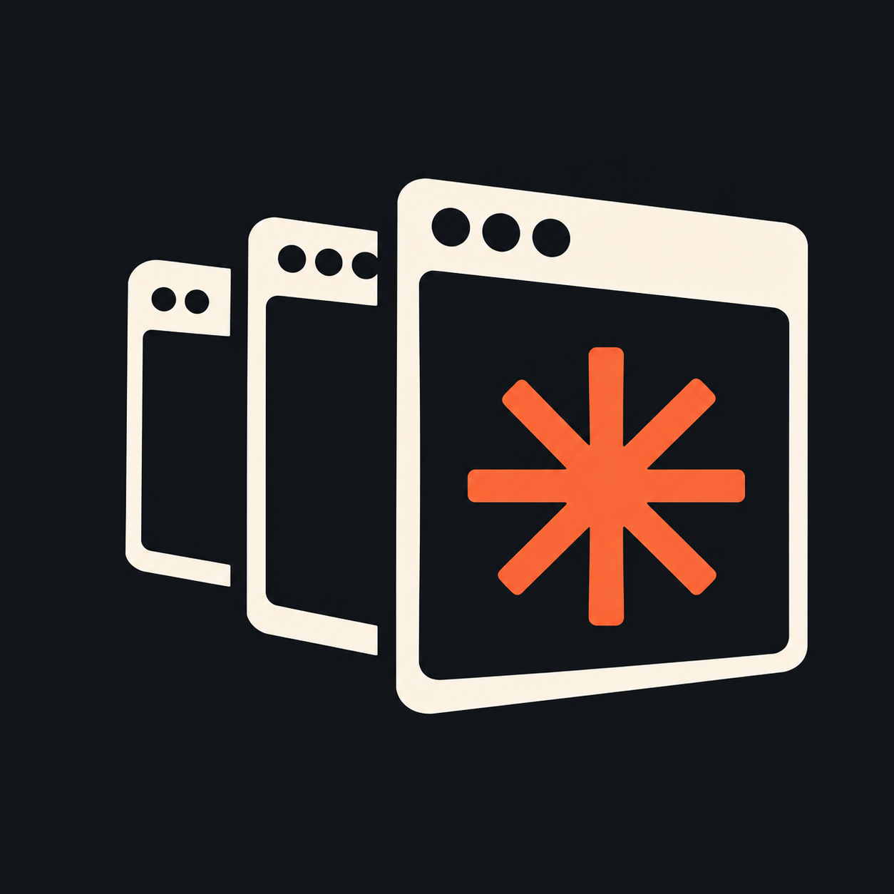

<p align="center"></p>

# ClauthBar

A small, read-only macOS menu bar display for [clauth](https://github.com/uwuclxdy/clauth).

The menu bar shows your active Claude Code profile with its **5h** and **7d** usage.
Click it to see every clauth profile with plan, usage windows, reset countdowns,
auth and fetch health, fallback-chain position, and daemon state.

ClauthBar never switches accounts or touches credentials. clauth owns all of that.
ClauthBar only reads the status feed clauth publishes, which contains no tokens.

```
personal  5H [■■□□□□|□□]  7D [■■■■■■■■■|■]
```

## Requirements

- macOS 14 (Sonoma) or newer
- [clauth](https://github.com/uwuclxdy/clauth) installed. A running `clauth daemon` keeps the numbers live.

## Install

### From a release

Download `ClauthBar-<version>.zip` from the [latest release](https://github.com/jpvalery/clauthbar/releases/latest), unzip it, and move
`ClauthBar.app` to `/Applications` or `~/Applications`.

Release builds are ad-hoc signed, not notarized, so the first launch is blocked by
Gatekeeper. Either right-click the app and choose **Open**, or clear the quarantine flag:

```sh
xattr -dr com.apple.quarantine /Applications/ClauthBar.app
```

### From source

Only the Xcode Command Line Tools (Swift 6) are needed:

```sh
git clone https://github.com/jpvalery/clauthbar.git
cd clauthbar
scripts/build-app.sh --install   # builds, copies to ~/Applications, launches
```

`swift run` also works for quick iteration. It runs the bare executable without an app
bundle, so launch at login is unavailable that way.

## How it works

ClauthBar reads [`~/.clauth/status.json`](https://github.com/uwuclxdy/clauth/wiki/Daemon#clauthstatusjson)
(schema 2), which `clauth daemon` rewrites every second or so. It re-reads the file
every 2 s and compares bytes, so switches show up almost immediately.

| Situation | What ClauthBar does |
|---|---|
| Daemon publishing (`generated_at` < 10 s old) | Renders the feed live. The popover shows a green **daemon live** dot. |
| Feed stops advancing | Amber **daemon stalling** dot; last values stay on screen. |
| No daemon | Runs `clauth status --json` every 30 s, which builds the same feed from clauth's on-disk caches. The popover offers **Start daemon**. |
| Feed `schema` newer than 2 | Shows "clauth newer than ClauthBar" instead of guessing. |

**Start daemon** runs `clauth daemon` detached from `~/.clauth`, appending its output
to `~/.clauth/daemon.log`, the same way clauth's TUI does. A second daemon exits on
its own, so clicking twice is harmless.

### Menu bar options

Use the slider icon in the popover to toggle:

- profile name
- 5h bar and 5h reset countdown
- 7d bar
- percentages instead of bars
- the pace tick, which marks how much of the window has elapsed. A fill past the tick means usage is outpacing time.
- launch at login

Bars turn orange at 75% and red at 90%. They dim when clauth marks the reading `stale`
or nothing is maintaining the data.

The weekly bar uses the `7d` window, or the plan's tier-labelled weekly window
(e.g. `7d fable` on Team plans) when that's the only one published.

### Finding `clauth`

GUI apps don't inherit your shell `PATH`. ClauthBar looks in `~/.local/bin`,
`~/.cargo/bin`, `/opt/homebrew/bin`, `/usr/local/bin` and `~/bin`. To override:

```sh
defaults write com.raccoonv.clauthbar clauthPath /path/to/clauth
```

A `CLAUTH_HOME` environment variable, if visible to GUI apps, replaces `~/.clauth`.

## Keeping the daemon running (optional)

To have launchd supervise the daemon, use `KeepAlive{SuccessfulExit=false}` and an
append-mode log, as the clauth docs recommend. Replace `YOU` with your username:

```xml
<!-- ~/Library/LaunchAgents/com.clauth.daemon.plist -->
<?xml version="1.0" encoding="UTF-8"?>
<!DOCTYPE plist PUBLIC "-//Apple//DTD PLIST 1.0//EN" "http://www.apple.com/DTDs/PropertyList-1.0.dtd">
<plist version="1.0">
<dict>
  <key>Label</key><string>com.clauth.daemon</string>
  <key>ProgramArguments</key>
  <array><string>/Users/YOU/.local/bin/clauth</string><string>daemon</string></array>
  <key>WorkingDirectory</key><string>/Users/YOU/.clauth</string>
  <key>RunAtLoad</key><true/>
  <key>KeepAlive</key><dict><key>SuccessfulExit</key><false/></dict>
  <key>StandardOutPath</key><string>/Users/YOU/.clauth/daemon.log</string>
  <key>StandardErrorPath</key><string>/Users/YOU/.clauth/daemon.log</string>
</dict>
</plist>
```

```sh
launchctl bootstrap gui/$(id -u) ~/Library/LaunchAgents/com.clauth.daemon.plist
```

## Development

| File | Role |
|---|---|
| `Sources/ClauthBar/StatusFeed.swift` | Codable model of the schema-2 feed (lenient: unknown fields ignored, absent ones defaulted) |
| `Sources/ClauthBar/FeedStore.swift` | Polls the file, judges daemon liveness, runs the CLI fallback, starts the daemon |
| `Sources/ClauthBar/StatusItemController.swift` | `NSStatusItem` + `NSPopover` hosting |
| `Sources/ClauthBar/MenuBarStripView.swift` | Two-line menu bar modules and the `UsageMeter` |
| `Sources/ClauthBar/PopoverView.swift` | Profile cards, daemon/gateway state, options menu |
| `scripts/build-app.sh` | Builds the `.app` bundle (and generates its `Info.plist`) |
| `scripts/make-icon.swift` | Turns `logo.png` into the rounded `AppIcon.icns` at build time |
| `logo.png` | Source artwork for the app icon (square, ≥1024 px) |

### Releasing

Push a tag like `v0.1.0`. The GitHub Actions workflow builds a universal (arm64 + x86_64)
app, zips it, and attaches it to a GitHub release with generated notes:

```sh
git tag v0.1.0 && git push origin v0.1.0
```

## Acknowledgements

The two-line, iStats-style menu bar layout was inspired by
[CCSwitcher](https://github.com/XueshiQiao/CCSwitcher). Usage data comes from
[clauth](https://github.com/uwuclxdy/clauth).

## License

[MIT](LICENSE)
